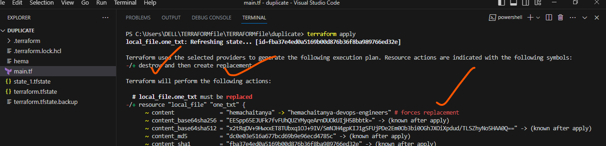

### TERRAFORM:
 terraform is a hashicroplanguage to extands plugins
 terraform is a multy cloud provider
 tf used not only for low level  building , changing and version of infrastructure safely  and efficiently .
 it managing multycloud provider
 Terraform  can  not  only  manage low-levelcomponents,  such  as compute  instances, storage,  and networking; it can also support high-level components, such as DNS and SaaS features, provided that the resource API is available from the providers.


### Terraform  init: 
to create background information

* terraform force-unlock <lock-id>

### console:
interactive console for tf interpoletion

### env

* terraform workspace <new/list/show/delete> <workspace-name>
work space management

### get 
download and install modules for configuration

### graph
create a visuall graph for tf resources

### import
imort the existing infrastructure into tf


### ouput
read and utput from statefile

### providers
prints a tree of the providers used in configuration

### refresh
update local statefile againest real resource
### show 
inspect tf state or plan
### taint
manually mark a resource for recreation

### untaint
manually unmark a resource as tainted
### version
printes the tf version
### workspace
workspace management


### Terraform validate: 
to check our data syntax will be correct or not

### Terraform fmt: 
write the code  arrangement is in proper setting 

### Terraform plan variables passing wayin terraform 

1. variables passing from command line 


2. when i passed the defaul values it will takes automatically with out  passing any value

```main.tf
provider "local" {
    
}
resource "local_file" "hmlt" {
    content = var.filename
    filename = var.content

}
## var.tf
variable "filename" {
    description = "hai ra mamma"
    type = string
    }
variable "content" {
    description = "main theam"
    type = string
  
}


i cannot mention any values aither default or any values

```


* we can give the values in values.tfvars
```values.tfvars
filename = "chaitanya"
content = "hai chaitu"
```


* above task resolve the issue by using "terraform apply -var-file=variable.tfvars"

3. rename the values.tfvars to terraform.tfvars


* here automatically  takes the values 

4. we can replace the terraform.tfvars to *.auto.tfvars


* variables are declared in json formate also , like "key"="value"


5. using environment variables 


* with out giving any defalut value 

export command gives on instance only 

    export TF_VAR_filename="hema.txt"

    export TF_VAR_content="ha chaitu, i am hema"


* automatically filles the values with out using -var-file


#### variables pass from the 
 what we want to create information will we gives its give plan of output

### Terraform apply: 
its createsome state file and create some work space

### Terraform apply -auto-approve: 
yes/no authentication not requaired

### Terraform apply -var ./values.tf:
  to take variables and values will be 
 attached we cannot change our templet we use variable file

  ### Terraform plan -target=”resoure_type.resource_name”: 
   we want to create only one resource we use -target=resource_type&resourc_name

* Assigning Values to Root Module Variables

* When variables are declared in the root module of your configuration, they can be set in a number of ways:

* Individually, with the -var command line option.

* In variable definitions (.tfvars) files, either specified on the command line or automatically loaded.

* As environment variables.

 ### terraform apply -var "region=ap-south-2" -var "ntier-vpc-range=10.10.0.0/16"

### terraform apply -var-file values.tfvars

Terraform also automatically loads a number of variable definitions files if they are present: Files named exactly terraform.tfvars or terraform.tfvars.json. Any files with names ending in .auto.tfvars or .auto.tfvars.json.

  Create loadbalancer manually and import state file into terraform

### Terraform import <resource_type>.<resource_name> <resoure_id>

first we create sample tf file 


Create more resources we apply only one resource 

### Terraform apply/plan/destroy -target=”<resource_type>.<resource_name>” 

Create  two resources in two different folders by using modules(alias)

How to remove resources from state file

### Terraform state rm <resource_type>.<resource_id>


### module tf

 it' a terraform configuration files in a single directory when we want to run module from single directory is known as root module

 ### 5 steps in terraoform

 terraform init

 terraform validate

  terraform fmt

 terraform apply

terrarom plan

terraform destroy

### state file locking
it's the statefile 
to that it can prevents operations on statefile being performed by multiusers so once lock released from oneuser then it's cann't access by another user

### remote backend :

 it's used to store terraform state remorte backend we use multicommands
  terraform init,fmt,validate,plan,apply and destroy


      terraform init -migrate-state

       terraform init -reconfigure


## without remort backend same templet creates two times 


  ### taint resource

  terraform taint <resource-type>.<resource-name>

  terraform untaint <resorce-type>.<resource-name>


  it's delete and recreate (you create local file and check)

### resource graph

it's created by using terraform graph 

### terraform templet component

    terraform provider: (where we want create infra)

    terraform resource : (what we want to create)

    argument: (nothing but input)

    attribute:(nothing but output)

## terraform backup
* when we create remort backup then its easy to remove statefiles we download from remort repo.
* by using backup command also we re-gather statefile contents(resources)


when we destroy resource then only back up file will be created

* after destroy  in state file data also deleted
* we recreate state file data by using backup file by using below command

### terraform apply -backup=<terraform_backup_file_path>


### terraform output -raw <> (is used to change the content)  
### difference between for_each and count funtions

#### count

count:

*  This is often brought up when talking about looping with Terraform.
(by using count single region only we create infra)


#### for_each
( we create resources in multiple regions and missplacing the value also it's takes )
* for_each: This technique is similar to the count method but has some advantages. It should be generally used overcount.

* The for_each argument will iterate over a data structure to configure resources or modules with each item in turn.

* It works best when the duplicate resources need to be configured differently but share the same lifecycle.

* It is more like any other for_each in any given programming language.when change the trigger cause the resourcce to be replaced .


###  terraform D:

* terraform D is a plugin 

## null resource

* null resource helps us to execute any command remotely   or locally to provision any resource or even to create a configuration file or perform some command or scripts to change some configuration

* 
### terraform charectoristics of terraform archistrecture

* backend
* ClI
* cofiguration loader
* expression evalution
* graph builder
* graph walk
* state manager
* vertex-evalution
* sub-graphs

### what is the tf cloud and it's uses

* tf cloud is an application that teams use tf together 
* it manages tf runs in a consistent  and relaiable env , and includes easy to share statefiles , screat data , access control for aprroving infrastructure.

features:

* audit logging
* SAML single sign-on

### terragrunt

* it's a  thin wrapper that provides extra tools for keep your configuration DRY , working with multiple tf modules ,and managing remort state.

* you can also execute  tf commands in multiple modules at a time. 


## task


![hea] (./Images/duplicate-state-3.png)




### funtions 

#### count 

* count hw many numbers we give that number exactly matches the  names of resource

* incase we are manually delete the middle resource then we can again terraform apply --auto-approve , then 3rd resource  delete and recreate .


* we can delete the 3rd file and change count is 4


* then 4 and 5 files are delete and recreate


## for_each

* we create 5 files in local 

* incase i can delete the 3rd file manually , and delete from terraform template we cannot change the files 


### length function

* count function is definatly we change the no.

* but in the length function first you create 5 files after that you want 7 files only you change the names extra we add .


