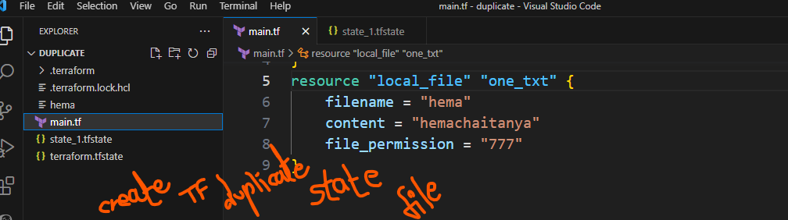
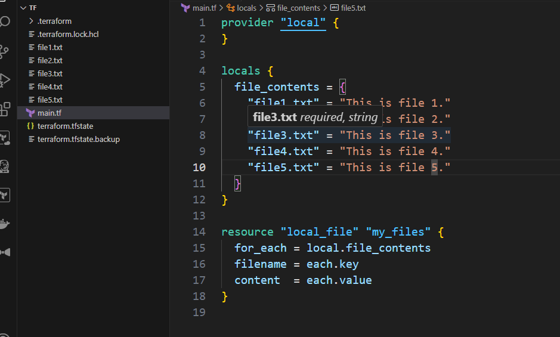

```terraform
1. What is Terraform in AWS ?
   
Terraform is an “Infrastructure as a code” tool that allows you to create, update, and version your infrastructure through coding instead of manual processes.

3. What are the most useful Terraform commands?
   
terraform init — Initializes the current directory, also Plugin Installation, Module Installation, Backend Initialization, and Version Checking is done in the background.

terraform refresh — Terraform compares the current state of your infrastructure with the state described in your Terraform configuration files and updates its state file accordingly

terraform output — Retrieve the values of output variables defined in your Terraform configuration.

terraform apply — Terraform to apply the changes described in your Terraform configuration files to your infrastructure.

terraform destroy — Terraform is used to destroy all the resources defined in your Terraform configuration.

terraform graph — Creates a DOT-formatted graph

terraform plan — Terraform is used to generate an execution plan based on your Terraform configuration files.

#### Scenario-Based Interview Questions

🔹Question 1: You have an existing infrastructure on AWS, and you need to use Terraform to manage it. How would you import these resources into your Terraform configuration?

We can use the terraform import command, we need to create a configuration file (dummy file)

terraform import [OPTION] ADDRESS_ID 

terraform import aws_instance.localname i-abcd123 

🔹 Question 2: You are working with multiple environments (e.g., dev, prod) and want to avoid duplicating code. How would you structure your Terraform configurations to achieve code reuse?
OR

Your team wants to ensure that the infrastructure is consistently provisioned across multiple environments. How would you implement a consistent environment configuration?

We make use of modules so that we can avoid duplication of code.

terraform workspace list #To list all workpace 

terraform workspace new dev

terraform workspace new prod

#Switching Between Workspaces 

terraform workspace select <workspace_name>

🔹 Question 3: Describe a situation where you might need to use the terraform remote backend, and what advantages does it offer in state management?

The terraform remote backend allows you to store Terraform state files in a centralized location, such as an object storage service like Amazon S3.

Benefits: Shared state, locking, secure state storage.

terraform {
  backend "s3" {
    bucket         = "<your_bucket_name>"
    key            = "terraform.tfstate"
    region         = "us-west-2"  # Update with your region
    dynamodb_table = "terraform_locks"  # Optional: Use DynamoDB for state locking
  }
}

🔹 Question 4: You need to create a highly available architecture in AWS using Terraform. Explain how you would implement an Auto Scaling Group with load balancing.

1. Define Load Balancer Resources: If you don’t already have a load balancer in your infrastructure, define the load balancer resources including the load balancer itself, a target group, and any necessary listeners and listener rules.

resource "aws_lb" "example" {
  name               = "example-lb"
  internal           = false
  load_balancer_type = "application"

  security_groups    = ["${aws_security_group.example.id}"]

  subnets            = ["${aws_subnet.example.id}"]
}


resource "aws_lb_target_group" "example" {
  name        = "example-tg"
  port        = 80
  protocol    = "HTTP"
  target_type = "instance"

  health_check {
    path                = "/"
    interval            = 30
    timeout             = 5
    healthy_threshold   = 2
    unhealthy_threshold = 2
  }

  vpc_id = "${aws_vpc.example.id}"
}

2. Define Auto Scaling Group: Define an Auto Scaling Group, referencing the existing or newly created launch configuration and specifying the load balancer target group to distribute traffic.

resource "aws_autoscaling_group" "example" {
  name                 = "example-asg"
  min_size             = 2
  max_size             = 5
  desired_capacity     = 2
  vpc_zone_identifier  = ["${aws_subnet.example.id}"]

  target_group_arns = ["${aws_lb_target_group.example.arn}"]
}

3. Attach ASG to Load Balancer: Ensure that the ASG is attached to the load balancer target group so that instances launched by the ASG are automatically registered with the load balancer.

resource "aws_autoscaling_attachment" "example" {
  autoscaling_group_name = "${aws_autoscaling_group.example.name}"
  alb_target_group_arn   = "${aws_lb_target_group.example.arn}"
}


🔹 Question 5: Your team is adopting a multi-cloud strategy, and you need to manage resources on both AWS and Azure using Terraform. How would you structure your Terraform code to handle this?

Organize Directories by Cloud Provider: Create separate directories for AWS and Azure within your Terraform project to keep the code organized and maintainable.

terraform_project/
├── aws/
│   ├── main.tf
│   ├── variables.tf
│   ├── outputs.tf
├── azure/
│   ├── main.tf
│   ├── variables.tf
│   ├── outputs.tf
└── modules/
    ├── aws_module/
    │   ├── main.tf
    │   ├── variables.tf
    │   ├── outputs.tf
    ├── azure_module/
    │   ├── main.tf
    │   ├── variables.tf
    │   ├── outputs.tf
Manage Provider Configurations: Declare provider configurations separately for AWS and Azure within their respective directories. This ensures that Terraform applies the correct provider settings for each cloud environment.

# AWS provider configuration in aws/main.tf

provider "aws" {
  region = "us-west-2"
}

# Azure provider configuration in azure/main.tf

provider "azurerm" {
  features {}
}
# Example of conditional resource creation based on provider

resource "aws_instance" "example" {
  count         = var.provider == "aws" ? 1 : 0
  
  # AWS-specific configuration
}

resource "azurerm_virtual_machine" "example" {
  count         = var.provider == "azure" ? 1 : 0
  
  # Azure-specific configuration
}
🔹 Question 6: You want to run specific scripts after provisioning resources with Terraform. How would you achieve this, and what provisioners might you use?
Running specific scripts after provisioning resources with Terraform can be achieved using provisioners.

Provisioners are a feature in Terraform that allow you to execute scripts or commands on local or remote machines as part of resource creation or destruction.

Inline Provisioners: Inline provisioners allow you to specify scripts directly within your Terraform configuration.

resource "aws_instance" "example" {
  # Instance configuration
  
  provisioner "remote-exec" {
    host = ipv4-public
    connect = ssh
    key = path
    user = ubuntu
    inline = [
      "echo Hello from provisioner",
      "sudo apt-get update",
      "sudo apt-get install -y nginx",
      "sudo systemctl start nginx"
    ]
  }
}

2. File Provisioners: File provisioners allow you to upload files from your local machine to a remote resource.

resource "aws_instance" "example" {
  # Instance configuration

  provisioner "file" {
    source      = "local/path/to/script.sh"
    destination = "/remote/path/to/script.sh"
  }

  provisioner "remote-exec" {
    inline = [
      "chmod +x /remote/path/to/script.sh",
      "/remote/path/to/script.sh"
    ]
  }
}

3. External Provisioners: External provisioners execute scripts or commands that are located externally from the Terraform configuration.

resource "aws_instance" "example" {
  # Instance configuration

  provisioner "local-exec" {
    command = "bash external_script.sh"
  }
}

🔹 Question 7: You are dealing with sensitive information, such as API keys, in your Terraform configuration. What approach would you take to manage these securely?

Use Environment Variables: Store sensitive information as environment variables on your local machine or CI/CD environment. Terraform can read these environment variables during runtime without exposing them directly in the configuration files.
Utilize Terraform Variables: Assign them default values equal to empty strings or placeholders. Then, reference these variables throughout your configuration.
variable "aws_access_key" {
  description = "AWS access key"
  default     = ""
}

variable "aws_secret_key" {
  description = "AWS secret key"
  default     = ""
}
3. Use Input Variables or TFVar Files:

variable "aws_access_key" {
  description = "AWS access key"
}

variable "aws_secret_key" {
  description = "AWS secret key"
}
Then, create a terraform.tfvars file with the actual values:

aws_access_key = "your-access-key"
aws_secret_key = "your-secret-key"
Or input the values directly when running Terraform commands:

terraform apply -var="aws_access_key=your-access-key" -var="aws_secret_key=your-secret-key"

🔹 Question 8: Describe a scenario where you might need to use Terraform workspaces, and how would you structure your project to take advantage of them?
Project Structure:

terraform_project/
├── environments/
│   ├── dev/
│   │   ├── main.tf
│   │   ├── variables.tf
│   │   ├── outputs.tf
│   ├── staging/
│   │   ├── main.tf
│   │   ├── variables.tf
│   │   ├── outputs.tf
│   ├── production/
│   │   ├── main.tf
│   │   ├── variables.tf
│   │   ├── outputs.tf
├── modules/
│   ├── vpc/
│   │   ├── main.tf
│   │   ├── variables.tf
│   │   ├── outputs.tf
│   ├── ec2/
│   │   ├── main.tf
│   │   ├── variables.tf
│   │   ├── outputs.tf
│   ├── rds/
│   │   ├── main.tf
│   │   ├── variables.tf
│   │   ├── outputs.tf
├── global_variables.tf
├── backend.tf
├── provider.tf

🔹 Question 9: You’ve made changes to your Terraform configuration, and now you want to preview the execution plan before applying the changes. How would you do this?

To preview the execution plan before applying changes to your Terraform configuration, you can use the terraform plan command.

terraform plan

🔹 Question 10: Your team has decided to adopt GitOps practices for managing infrastructure with Terraform. How would you integrate Terraform with version control systems like Git?

1. Choose a Git Repository

Select a Git repository hosting platform (e.g., GitHub, GitLab, Bitbucket).

Create a repository to store Terraform configurations.

#Create a new repository named terraform-aws on GitHub.

#Steps:
#Go to GitHub and create a new repository.
#Clone the repository to your local machine:


git clone https://github.com/your-username/terraform-aws.git

2. Commit Terraform Configurations

Commit Terraform configuration files (*.tf) to the repository.

Include main configuration files, variable definitions, output definitions, and modules.

#Commit Terraform configuration files to the repository. 

#Create a directory structure for Terraform configurations:

terraform-aws/
├── main.tf
├── variables.tf
├── outputs.tf
├── modules/
│   ├── vpc/
│   │   ├── main.tf
│   │   ├── variables.tf
│   │   ├── outputs.tf
│   ├── ec2/
│   │   ├── main.tf
│   │   ├── variables.tf
│   │   ├── outputs.tf
#Add and commit Terraform configuration files to the repository:

git add .
git commit -m "Initial Terraform configurations"
git push origin main

3. Use Git Branches for Environments

Utilize Git branches to represent different environments (e.g., dev, staging, production).

Each environment branch contains environment-specific Terraform configurations.

#Example: Create separate branches for development, staging, and production environments.

#Steps:
#Create a new branch for the dev environment:

git checkout -b dev

#Commit environment-specific Terraform configurations to the dev branch.

#Repeat steps 1-2 for staging and production branches.

4. Automate Pull Requests and Reviews

Implement a workflow requiring pull requests (PRs) and code reviews for Terraform changes.

Ensure changes are reviewed and approved by team members before merging.

#Configure GitHub to require pull requests and code reviews for Terraform changes.

#Steps:
#Go to the repository settings on GitHub.
#Under "Branch protection rules", enable required pull request reviews and specify the number of reviewers required.
5. Leverage Git Hooks

Utilize Git hooks to trigger actions automatically based on Git events.

Use pre-commit hooks for Terraform validation or formatting checks.

#Make the script executable:

chmod +x .git/hooks/pre-commit

6. Continuous Integration/Continuous Deployment (CI/CD)

Set up CI/CD pipelines to automate Terraform workflows.

Perform tasks such as validation, plan generation (terraform plan), and applying changes (terraform apply).

7. Manage Secrets Securely

Avoid storing sensitive information directly in Terraform configurations.

Utilize environment variables, Terraform Vault integration, or secrets management solutions.

 . What is the use of terraform.lock.hcl file
lock. hcl . It captures the versions of all the Terraform providers you’re using. Normally, you want to check this file into version control so that when your team members run Terraform, they get the exact same provider versions.

2. How to enable detailed logs in Terraform?
You can adjust the logging verbosity level using the TF_LOG environment variable.

Set the TF_LOG Environment Variable:
Example command for setting the TF_LOG environment variable to DEBUG:

export TF_LOG=DEBUG

Set the TF_LOG environment variable to one of the following values:
TRACE: This is the most detailed logging level and provides extensive information about Terraform's internal operations. 
It's helpful for debugging complex issues but can produce a large amount of output.
DEBUG: This level is less detailed than TRACE but still provides verbose information useful for debugging.
INFO: This is the default logging level. It provides basic informational messages about Terraform's actions.
WARN: This level only displays warning messages.
ERROR: This level only displays error messages.
2. Run Terraform Commands:

After setting the TF_LOG environment variable, run your Terraform commands as usual (e.g., terraform apply, terraform plan, etc.).
3. View the Detailed Logs:

Terraform will now output detailed logs according to the verbosity level set by the TF_LOG environment variable. You'll see additional information about what Terraform is doing behind the scenes.
3. What if you accidentally delete the Terraform state file?
OR

You want to make changes in the configuration of already created resources using Terraform.
Restore from Backup: If you have a backup of the state file, you can restore it from there. Regularly backing up your state files is a good practice to prevent data loss.
Recreate the State File:
terraform import
If your infrastructure is still intact you can recreate the state file.

4. Difference between Local variables and Terraform variables?
Local Variables: Limited to a module or resource block and can’t be overridden.

locals {
  instance_type = "t2.micro"
  instance_count = 3
  total_capacity = local.instance_count * 2  # Example expression
}
Terraform Variables: Broad, accessible across modules and configs
Global level usages and can be overridden.

variable "region" {
  type    = string
  default = "us-east-1"
}

resource "aws_instance" "example" {
  instance_type = "t2.micro"
  ami           = "ami-0c55b159cbfafe1f0"
  region        = var.region  # Using Terraform variable
}
5. What components you have created using Terraform?
Virtual Machines (VMs) — Instances in AWS
resource "aws_instance" "example" {
  ami           = "ami-0c55b159cbfafe1f0"
  instance_type = "t2.micro"
  tags = {
    Name = "ExampleInstance"
  }
}
2. Networking Resources — VPC, Subnets, load balancers, and security groups

resource "aws_vpc" "example" {
  cidr_block = "10.0.0.0/16"
}

resource "aws_subnet" "example" {
  vpc_id            = aws_vpc.example.id
  cidr_block        = "10.0.1.0/24"
  availability_zone = "us-west-1a"
}
3. Storage Resources — Storage buckets, block storage volumes, and file storage systems

resource "aws_s3_bucket" "example" {
  bucket = "example-bucket"
  acl    = "private"
}
4. Database Instances — Deploying databases such as MySQL, PostgreSQL, MongoDB, or DynamoDB

resource "aws_db_instance" "example" {
  engine            = "mysql"
  instance_class    = "db.t2.micro"
  allocated_storage = 10
  storage_type      = "gp2"
}
5. Containerized Applications — Orchestrating containerized applications using Kubernetes clusters.

provider "aws" {
  region = "us-west-2"
}

provider "kubernetes" {
  config_path    = "~/.kube/config"  # Path to your kubeconfig file
}

module "eks_cluster" {
  source  = "terraform-aws-modules/eks/aws"
  version = "~> 18.0"

  cluster_name    = "example-cluster"
  cluster_version = "1.21"

  # Master node configuration
  create_eks = true
  cluster_create_timeout = "30m"

  vpc_id     = "your-vpc-id"
  subnets    = ["your-subnet-ids"]
  tags       = {
    Environment = "test"
  }

  # Node group configuration
  node_groups = {
    example_node_group = {
      desired_capacity = 2
      max_capacity     = 2
      min_capacity     = 1

      instance_type = "t3.medium"
    }
  }
}
Kubernetes version : 1.29 Amazon EKS release January 23, 2024

6. Identity and Access Management (IAM) — Defining roles, policies, and permissions for managing access to resources.

resource "aws_iam_user" "example" {
  name = "example-user"
}

resource "aws_iam_user_policy_attachment" "example" {
  user       = aws_iam_user.example.name
  policy_arn = aws_iam_policy.example.arn
}
6. Terraform Lifecycle:
Allows you to configure certain behaviors related to resource lifecycle management. It provides control over when certain actions, such as create, update, or delete, should occur for a particular resource.

Here are some common configurations that can be set within the lifecycle block:

Create Before Destroy:

lifecycle {
  create_before_destroy = true
}
Ignore Changes:

lifecycle {
  ignore_changes = ["attribute1", "attribute2"]
}
Prevent Destroy:

lifecycle {
  prevent_destroy = true
}
Depends On:

lifecycle {
  depends_on = ["aws_s3_bucket.example"]
}
Here’s an example demonstrating the usage of lifecycle block with the create_before_destroy configuration:

resource "aws_instance" "example" {
  # Resource configuration...

  lifecycle {
    create_before_destroy = true
  }
}
7. How we can destroy specific resources without affecting others?
terraform destroy -target=resource_type.resource_name
terraform destroy -target=aws_instance.localname
8. What are the functions in the terraform?
Functions provide a powerful way to manipulate and transform data within your Terraform configurations, making it easier to express complex logic and requirements.

Here are some common categories of functions in Terraform:

String Functions:
format(): Formats a string according to a format specifier.
join(): Concatenates a list of strings into a single string with a delimiter.
replace(): Replaces occurrences of a substring within a string.
substr(): Returns a substring of a string.
2. List Functions:

concat(): Concatenates lists together into a single list.
element(): Returns the element at a specified index of a list.
length(): Returns the length of a list.
slice(): Returns a subset of a list based on start and end indices.
3. Map Functions:

keys(): Returns a list of keys from a map.
values(): Returns a list of values from a map.
merge(): Merges multiple maps into a single map.
map(): Transforms each element of a list using a specified function.
4. Numeric Functions:

abs(): Returns the absolute value of a number.
max(): Returns the maximum value from a list of numbers.
min(): Returns the minimum value from a list of numbers.
random(): Generates a random integer within a specified range.
5. Type Conversion Functions:

tolist(): Converts a string or map to a list.
toset(): Converts a list to a set.
tomap(): Converts a list of lists into a map.
6. Encoding and Decoding Functions:

base64encode(): Encodes a string to Base64.
base64decode(): Decodes a Base64-encoded string.
9. What are the different types of modules in terraform?
Root Modules: Root modules are the top-level configurations in a Terraform project.
They typically define the main configuration files (main.tf, variables.tf, outputs.tf) and may contain resource definitions, variables, outputs, and other configuration elements directly.
main.tf:

resource "aws_instance" "example" {
  ami           = "ami-0c55b159cbfafe1f0"
  instance_type = "t2.micro"
}
variables.tf: 

variable "instance_name" {
  type    = string
  default = "example-instance"
}
outputs.tf:

output "instance_id" {
  value = aws_instance.example.id
}
Calling the Root Module:

module "example_root" {
  source = "./"
}
2. Child Modules: Child modules are modular components that can be used within root modules or other child modules.
They allow you to break down complex configurations into smaller, more manageable pieces.
Child modules can have their own resource definitions, variables, outputs, and other configuration elements.

child_module/child_module.tf:

resource "aws_s3_bucket" "example" {
  bucket = var.bucket_name
}
child_module/variables.tf:

variable "bucket_name" {
  type    = string
  default = "example-bucket"
}
main.tf (calling the child module):

module "example_child" {
  source = "./child_module"
}
3. Reusable Modules: Reusable modules are modules designed to be shared and reused across multiple projects or environments.
They encapsulate common infrastructure patterns, configurations, and best practices, allowing you to standardize and reuse infrastructure code across your organization.

reusable_module/ec2_instance/main.tf:

resource "aws_instance" "example" {
  ami           = var.ami_id
  instance_type = var.instance_type
}
reusable_module/ec2_instance/variables.tf:

variable "ami_id" {
  type    = string
  default = "ami-0c55b159cbfafe1f0"
}

variable "instance_type" {
  type    = string
  default = "t2.micro"
}
main.tf (calling the reusable module):

module "example_reusable" {
  source = "git::https://github.com/example/reusable_module.git//ec2_instance"
}
4. Provider Modules: Provider modules encapsulate provider-specific configurations and resources.
They are used to define resources and configurations that are specific to a particular cloud provider or service provider (e.g., AWS, Azure, Google Cloud Platform, etc.).
Provider modules help abstract provider-specific details and promote portability across different cloud environments.

Provider modules are typically provided by Terraform providers (e.g., aws, azure, google). You can call provider modules directly in your configuration without defining them separately.
5. Data Modules: Data modules provide a way to retrieve and reference external data sources within your Terraform configurations.
They are used to fetch and process data from external systems or APIs (e.g., AWS S3 buckets, Azure Key Vault secrets, etc.) and make that data available for use within your Terraform configurations.

main.tf (using AWS S3 bucket data source):

data "aws_s3_bucket" "example" {
  bucket = "example-bucket"
}

output "bucket_arn" {
  value = data.aws_s3_bucket.example.arn
}
6. Composite Modules: Composite modules are modules that combine multiple child modules or resources into a single, cohesive unit.
They allow you to encapsulate complex infrastructure configurations and define higher-level abstractions that represent entire application stacks or environments

composite_module/main.tf:

module "example_child" {
  source = "./child_module"
}

module "example_reusable" {
  source = "git::https://github.com/example/reusable_module.git//ec2_instance"
}
main.tf (calling the composite module):

module "example_composite" {
  source = "./composite_module"
}
7. Publish Module: Once the module is published, you can call it from other Terraform configurations using the module block and specifying the source of the module.

module "example_module" {
  source  = "github.com/organization/module-name"
  version = "1.0.0"

  # Optionally, specify input variables
  variable1 = "value1"
  variable2 = "value2"
}
When you run terraform init in the directory containing your configuration, Terraform will download the module from the specified source and version.

10. What is a state file and when it is created?
The state file in Terraform is a JSON file that keeps track of your infrastructure’s current state. It’s created when you first apply your Terraform configuration using terraform apply. The state file is essential for Terraform to understand your infrastructure and make necessary changes. It's important to manage state files securely as they contain sensitive information.

11. What are NULL Reasoures used for?
Null resources in Terraform are like a blank canvas where you can write your own instructions. They don’t represent any real infrastructure but allow you to run custom actions or commands when Terraform runs.

resource "null_resource" "example" {
  provisioner "local-exec" {
    command = "echo 'Hello, Terraform!'"
  }
}
12. What are Date sources block in Terraform and how do you use them?
Data sources in Terraform allow you to use the information defined outside of Terraform, defined by another separate Terraform configuration or modified by functions

data "aws_ami" "example" {
  most_recent = true
  owners = ["self"]
  tags = {
    Name = "app-server"
    Tested = "true"
  }
}
13. What is a Dynamic block?
The dynamic block in Terraform allows you to generate multiple nested blocks dynamically based on a list or map variable.

The syntax for the dynamic block is as follows:

dynamic "block_type" {
  for_each = var.collection
  content {
    # Block content
  }
}
Here’s a simple example of how you might use the dynamic block to create multiple AWS EC2 instances based on a list of instance types:

resource "aws_instance" "example" {
  dynamic "instance" {
    for_each = var.instance_types
    content {
      ami           = "ami-12345678"
      instance_type = instance.value
    }
  }
}
variable "instance_types" {
  type    = list(string)
  default = ["t2.micro", "t2.small", "t2.medium"]
}
14. What are service endpoint and private endpoint?
Service endpoints in AWS provide private connectivity between your VPC and AWS services like S3 or DynamoDB.

While private endpoints (powered by AWS PrivateLink) offer private access to services like EC2 or RDS within your VPC.

Both ensure secure communication without exposure to the public internet.

Service Endpoint:
A service endpoint is an interface provided by AWS that allows you to privately connect your VPC to supported AWS services.
When you create a service endpoint, AWS allocates a private IP address from your VPC’s CIDR block for the service.
Traffic to the service endpoint stays within the AWS network and doesn’t traverse the internet.
Service endpoints are used for AWS services like Amazon S3, DynamoDB, and others.
resource "aws_vpc_endpoint" "s3" {
  vpc_id            = aws_vpc.example.id
  service_name      = "com.amazonaws.region.s3"
  route_table_ids   = [aws_route_table.private.id]
}
2. Private Endpoint:

A private endpoint, also known as an interface endpoint, allows you to connect to AWS services using a private IP address in your VPC.
Private endpoints are used for services that are powered by AWS PrivateLink, which enables private connectivity between VPCs and AWS services.
They provide a more granular control over access to the service and can be placed in specific subnets within your VPC.
Private endpoints are used for services like Amazon EC2, Amazon RDS, and others.
resource "aws_vpc_endpoint_service" "example" {
  service_name      = "com.amazonaws.region.ec2"
}

resource "aws_vpc_endpoint" "example" {
  vpc_id            = aws_vpc.example.id
  service_name      = aws_vpc_endpoint_service.example.service_name
  subnet_ids        = [aws_subnet.private.id]
}
15. How can we rename a resource in Terraform without deleting it?
terraform state mv <resource_type>.<current_name> <resource_type>.<new_name>
terraform state mv aws_instance.example_instance aws_instance.new_instance
16. What is a Terraform workspace?
Let’s assume you have a simple Terraform configuration for provisioning an AWS EC2 instance:

# main.tf

provider "aws" {
  region = "us-west-2"
}

resource "aws_instance" "example" {
  ami           = "ami-0c55b159cbfafe1f0"
  instance_type = "t2.micro"
}
Now, let's create two separate workspaces for the development and production environments:

# Create a new workspace for development
terraform workspace new development

# Switch to the development workspace
terraform workspace select development
In the development workspace, you might want to override certain configuration values, such as the instance type:

# Override instance type for development environment
variable "instance_type" {
  default = "t2.small"
}

resource "aws_instance" "example" {
  ami           = "ami-0c55b159cbfafe1f0"
  instance_type = var.instance_type
}
Similarly, for the production workspace:

# Create a new workspace for production
terraform workspace new production

# Switch to the production workspace

terraform workspace select production

# Override instance type for production environment
variable "instance_type" {
  default = "t2.large"
}

resource "aws_instance" "example" {
  ami           = "ami-0c55b159cbfafe1f0"
  instance_type = var.instance_type
}
Here’s an example of how you can use Terraform workspaces to manage multiple environments:

# Set the workspace based on the value of an environment variable

terraform {
  backend "local" {
    workspace_dir = "${path.root}/workspaces/${var.environment}"
  }
}
variable "environment" {x
  default = "development"
}

# Use the workspace name to create environment-specific resources
resource "aws_instance" "my_instance" {
  ami           = data.aws_ami.ubuntu.id
  instance_type = "t2.micro"
  tags = {
    Name = "my-instance-${terraform.workspace}"
  }
}
We’re using a local backend and setting the workspace_dir based on the value of an environment variable called environment. This allows us to switch between different workspaces by setting the environment variable to the desired value.

### TERRAFORM:

 terraform is a hashicroplanguage to extands plugins

 terraform is a multy cloud provider

 tf used not only for low level  building , changing and version of infrastructure safely  and efficiently .

 it managing multycloud provider

 Terraform  can  not  only  manage low-levelcomponents,  
 such  as compute  instances, storage,  and networking; it can also support high-level
  components, such as DNS and SaaS features, provided that the resource API is available from the providers.

 ### In Terraform, the state file (terraform.tfstate) keeps track of resources that have been created and managed. If you create resources using one version of Terraform and want to retrieve those resources or revert to a previous version, here are the steps you can follow:

1. Understanding Terraform State File:

* When you apply a Terraform configuration (terraform apply), Terraform generates a terraform.tfstate file that stores the current state of your resources.

* The state file contains all the information about resources (such as EC2 instances, VPCs, etc.) that Terraform is managing.

* Terraform uses the state file during future plan and apply operations to determine the delta between the desired and actual state of your infrastructure.

2. Retrieve Resources from State File:

* If you want to retrieve information about specific resources in the state file, you can use the following Terraform commands.


A. Show the State File:

This command shows the entire content of the state file in a human-readable format:

terraform show terraform.tfstate
B. Get Details of a Specific Resource:
If you know the resource type and name, you can get details of a specific 

* resource in the state file by using:

terraform state show <resource_type>.<resource_name>
Example:


* terraform state show aws_instance.my_instance
This will output detailed information (such as IP, ID, etc.) about the aws_instance resource with the name my_instance.

3. Reverting to a Previous Terraform Version:
If you want to revert to a previous version of Terraform and manage the same resources, follow these steps:

A. Check Current Terraform Version:
First, check your current Terraform version:

bash
Copy code
terraform version
B. Switch to a Previous Terraform Version:
You can manually download and install a previous version of Terraform. Here are two options:

Using Version Managers (e.g., tfenv): If you use tfenv (Terraform version manager), you can easily switch between versions:

bash
Copy code
tfenv install <version>  # e.g., tfenv install 1.0.11
tfenv use <version>
Manual Installation: Go to the Terraform releases page and download the desired version. Replace the existing Terraform binary with the downloaded one.

C. Re-initialize Terraform:
After changing the Terraform version, you need to re-initialize your project to download the correct provider plugins for that version:

bash
Copy code
terraform init
4. Downgrading or Upgrading State:
If you’re changing versions, there’s a chance that newer state files may not be compatible with older versions. If Terraform detects this, it will warn you or fail. In that case, you should:

Backup your state file before downgrading:

bash
Copy code
cp terraform.tfstate terraform.tfstate.backup
If you need to migrate the state file to an older version or handle version differences, you can use:


##### terraform state pull
   Retrieves the latest state from remote backends
terraform state push  # Pushes local state to remote backends
5. Restoring or Managing the State Manually:
If the state file is lost or corrupted, you can:

Manually import resources back into Terraform state using the terraform import command. This is useful if resources still exist in your cloud environment but are no longer tracked by the state file.
bash
Copy code
terraform import <resource_type>.<resource_name> <resource_id>
Example:
bash
Copy code
terraform import aws_instance.my_instance i-1234567890abcdef0
6. Using a Version Constraint in Terraform Configuration:
To ensure that your configuration works with a specific version of Terraform, you can define a
```

 ### Terraform
 
 * is an *infrastructure as code (IaC)* tool that allows you to manage and provision infrastructure resources using a human-readable configuration file. *Here are some essential Terraform commands for a DevOps engineer* :

### Initialization and Setup*

1. `terraform init` - Initialize a new Terraform working directory
2. `terraform version` - Check the Terraform version
3. `terraform login` - Authenticate with Terraform Cloud or Enterprise

### Configuration and Planning*

1. `terraform config` - Validate and inspect the Terraform configuration
2. `terraform plan` - Generate and show an execution plan
3. `terraform plan -out=<file>` - Save the plan to a file for later execution

#### Deployment and Management*

1. `terraform apply` - Apply the configuration and create resources
2. `terraform apply -auto-approve` - Apply without prompting for approval
3. `terraform destroy` - Destroy all resources managed by Terraform
4. `terraform refresh` - Update the Terraform state to match the current infrastructure
5. `terraform import` - Import existing infrastructure into Terraform

### State Management*

1. `terraform state list` - List all resources in the Terraform state
2. `terraform state show <resource>` - Show the details of a specific resource
3. `terraform state mv <resource> <new_name>` - Rename a resource
4. `terraform state rm <resource>` - Remove a resource from the state

#### Modules and Workspaces*

1. `terraform module` - Manage reusable Terraform modules
2. `terraform workspace` - Manage multiple, isolated Terraform workspaces
3. `terraform workspace select <workspace>` - Switch to a different workspace

### Other Commands*

1. `terraform output` - Show output values from the Terraform configuration
2. `terraform console` - Open an interactive Terraform console
3. `terraform graph` - Generate a visual graph of the Terraform configuration
4. `terraform debug` - Enable debug logging for Terraform

*Note* : This is not an exhaustive list, but it covers many essential Terraform commands for DevOps engineers. For more information, you can refer to the official Terraform documentation


### Terraform  init: 
to create background information

* terraform force-unlock <lock-id>

### console:
interactive console for tf interpoletion

### env

* terraform workspace <new/list/show/delete> <workspace-name>
work space management

### get 
download and install modules for configuration

### graph
create a visuall graph for tf resources

### import
imort the existing infrastructure into tf


### ouput
read and utput from statefile

### providers
prints a tree of the providers used in configuration

### refresh
update local statefile againest real resource
### show 
inspect tf state or plan
### taint
manually mark a resource for recreation

### untaint
manually unmark a resource as tainted
### version
printes the tf version
### workspace
workspace management


### Terraform validate: 
to check our data syntax will be correct or not

### Terraform fmt: 
write the code  arrangement is in proper setting 

### Terraform plan variables passing wayin terraform 

1. variables passing from command line 


2. when i passed the defaul values it will takes automatically with out  passing any value

```main.tf
provider "local" {
    
}
resource "local_file" "hmlt" {
    content = var.filename
    filename = var.content

}
## var.tf
variable "filename" {
    description = "hai ra mamma"
    type = string
    }
variable "content" {
    description = "main theam"
    type = string
  
}


i cannot mention any values aither default or any values

```


* we can give the values in values.tfvars
```values.tfvars
filename = "chaitanya"
content = "hai chaitu"
```


* above task resolve the issue by using "terraform apply -var-file=variable.tfvars"

3. rename the values.tfvars to terraform.tfvars


* here automatically  takes the values 

4. we can replace the terraform.tfvars to *.auto.tfvars


* variables are declared in json formate also , like "key"="value"


5. using environment variables 


* with out giving any defalut value 

export command gives on instance only 

    export TF_VAR_filename="hema.txt"

    export TF_VAR_content="ha chaitu, i am hema"


* automatically filles the values with out using -var-file


#### variables pass from the 
 what we want to create information will we gives its give plan of output

### Terraform apply: 
its createsome state file and create some work space

### Terraform apply -auto-approve: 
yes/no authentication not requaired

### Terraform apply -var ./values.tf:
  to take variables and values will be 
 attached we cannot change our templet we use variable file

  ### Terraform plan -target=”resoure_type.resource_name”: 
   we want to create only one resource we use -target=resource_type&resourc_name

* Assigning Values to Root Module Variables

* When variables are declared in the root module of your configuration, they can be set in a number of ways:

* Individually, with the -var command line option.

* In variable definitions (.tfvars) files, either specified on the command line or automatically loaded.

* As environment variables.

 ### terraform apply -var "region=ap-south-2" -var "ntier-vpc-range=10.10.0.0/16"

### terraform apply -var-file values.tfvars

Terraform also automatically loads a number of variable definitions files if they are present: Files named exactly terraform.tfvars or terraform.tfvars.json. Any files with names ending in .auto.tfvars or .auto.tfvars.json.

  Create loadbalancer manually and import state file into terraform

### Terraform import <resource_type>.<resource_name> <resoure_id>

first we create sample tf file 


Create more resources we apply only one resource 

### Terraform apply/plan/destroy -target=”<resource_type>.<resource_name>” 

Create  two resources in two different folders by using modules(alias)

How to remove resources from state file

### Terraform state rm <resource_type>.<resource_id>


### module tf

 it' a terraform configuration files in a single directory when we want to run module from single directory is known as root module

  . What is the use of terraform.lock.hcl file
lock. hcl . It captures the versions of all the Terraform providers you’re using. Normally, you want to check this file into version control so that when your team members run Terraform, they get the exact same provider versions.

2. How to enable detailed logs in Terraform?
You can adjust the logging verbosity level using the TF_LOG environment variable.

Set the TF_LOG Environment Variable:
Example command for setting the TF_LOG environment variable to DEBUG:

export TF_LOG=DEBUG

Set the TF_LOG environment variable to one of the following values:
TRACE: This is the most detailed logging level and provides extensive information about Terraform's internal operations. 
It's helpful for debugging complex issues but can produce a large amount of output.
DEBUG: This level is less detailed than TRACE but still provides verbose information useful for debugging.
INFO: This is the default logging level. It provides basic informational messages about Terraform's actions.
WARN: This level only displays warning messages.
ERROR: This level only displays error messages.
2. Run Terraform Commands:

After setting the TF_LOG environment variable, run your Terraform commands as usual (e.g., terraform apply, terraform plan, etc.).
3. View the Detailed Logs:

Terraform will now output detailed logs according to the verbosity level set by the TF_LOG environment variable. You'll see additional information about what Terraform is doing behind the scenes.
3. What if you accidentally delete the Terraform state file?
OR

You want to make changes in the configuration of already created resources using Terraform.
Restore from Backup: If you have a backup of the state file, you can restore it from there. Regularly backing up your state files is a good practice to prevent data loss.
Recreate the State File:
terraform import
If your infrastructure is still intact you can recreate the state file.

4. Difference between Local variables and Terraform variables?
Local Variables: Limited to a module or resource block and can’t be overridden.

locals {
  instance_type = "t2.micro"
  instance_count = 3
  total_capacity = local.instance_count * 2  # Example expression
}
Terraform Variables: Broad, accessible across modules and configs
Global level usages and can be overridden.

variable "region" {
  type    = string
  default = "us-east-1"
}

resource "aws_instance" "example" {
  instance_type = "t2.micro"
  ami           = "ami-0c55b159cbfafe1f0"
  region        = var.region  # Using Terraform variable
}
5. What components you have created using Terraform?
Virtual Machines (VMs) — Instances in AWS
resource "aws_instance" "example" {
  ami           = "ami-0c55b159cbfafe1f0"
  instance_type = "t2.micro"
  tags = {
    Name = "ExampleInstance"
  }
}
2. Networking Resources — VPC, Subnets, load balancers, and security groups

resource "aws_vpc" "example" {
  cidr_block = "10.0.0.0/16"
}

resource "aws_subnet" "example" {
  vpc_id            = aws_vpc.example.id
  cidr_block        = "10.0.1.0/24"
  availability_zone = "us-west-1a"
}
3. Storage Resources — Storage buckets, block storage volumes, and file storage systems

resource "aws_s3_bucket" "example" {
  bucket = "example-bucket"
  acl    = "private"
}
4. Database Instances — Deploying databases such as MySQL, PostgreSQL, MongoDB, or DynamoDB

resource "aws_db_instance" "example" {
  engine            = "mysql"
  instance_class    = "db.t2.micro"
  allocated_storage = 10
  storage_type      = "gp2"
}
5. Containerized Applications — Orchestrating containerized applications using Kubernetes clusters.

provider "aws" {
  region = "us-west-2"
}

provider "kubernetes" {
  config_path    = "~/.kube/config"  # Path to your kubeconfig file
}

module "eks_cluster" {
  source  = "terraform-aws-modules/eks/aws"
  version = "~> 18.0"

  cluster_name    = "example-cluster"
  cluster_version = "1.21"

  # Master node configuration
  create_eks = true
  cluster_create_timeout = "30m"

  vpc_id     = "your-vpc-id"
  subnets    = ["your-subnet-ids"]
  tags       = {
    Environment = "test"
  }

  # Node group configuration
  node_groups = {
    example_node_group = {
      desired_capacity = 2
      max_capacity     = 2
      min_capacity     = 1

      instance_type = "t3.medium"
    }
  }
}
Kubernetes version : 1.29 Amazon EKS release January 23, 2024

6. Identity and Access Management (IAM) — Defining roles, policies, and permissions for managing access to resources.

resource "aws_iam_user" "example" {
  name = "example-user"
}

resource "aws_iam_user_policy_attachment" "example" {
  user       = aws_iam_user.example.name
  policy_arn = aws_iam_policy.example.arn
}
6. Terraform Lifecycle:
Allows you to configure certain behaviors related to resource lifecycle management. It provides control over when certain actions, such as create, update, or delete, should occur for a particular resource.

Here are some common configurations that can be set within the lifecycle block:

Create Before Destroy:

lifecycle {
  create_before_destroy = true
}
Ignore Changes:

lifecycle {
  ignore_changes = ["attribute1", "attribute2"]
}
Prevent Destroy:

lifecycle {
  prevent_destroy = true
}
Depends On:

lifecycle {
  depends_on = ["aws_s3_bucket.example"]
}
Here’s an example demonstrating the usage of lifecycle block with the create_before_destroy configuration:

resource "aws_instance" "example" {
  # Resource configuration...

  lifecycle {
    create_before_destroy = true
  }
}
7. How we can destroy specific resources without affecting others?
terraform destroy -target=resource_type.resource_name
terraform destroy -target=aws_instance.localname
8. What are the functions in the terraform?
Functions provide a powerful way to manipulate and transform data within your Terraform configurations, making it easier to express complex logic and requirements.

Here are some common categories of functions in Terraform:

String Functions:
format(): Formats a string according to a format specifier.
join(): Concatenates a list of strings into a single string with a delimiter.
replace(): Replaces occurrences of a substring within a string.
substr(): Returns a substring of a string.
2. List Functions:

concat(): Concatenates lists together into a single list.
element(): Returns the element at a specified index of a list.
length(): Returns the length of a list.
slice(): Returns a subset of a list based on start and end indices.
3. Map Functions:

keys(): Returns a list of keys from a map.
values(): Returns a list of values from a map.
merge(): Merges multiple maps into a single map.
map(): Transforms each element of a list using a specified function.
4. Numeric Functions:

abs(): Returns the absolute value of a number.
max(): Returns the maximum value from a list of numbers.
min(): Returns the minimum value from a list of numbers.
random(): Generates a random integer within a specified range.
5. Type Conversion Functions:

tolist(): Converts a string or map to a list.
toset(): Converts a list to a set.
tomap(): Converts a list of lists into a map.
6. Encoding and Decoding Functions:

base64encode(): Encodes a string to Base64.
base64decode(): Decodes a Base64-encoded string.
9. What are the different types of modules in terraform?
Root Modules: Root modules are the top-level configurations in a Terraform project.
They typically define the main configuration files (main.tf, variables.tf, outputs.tf) and may contain resource definitions, variables, outputs, and other configuration elements directly.
main.tf:

resource "aws_instance" "example" {
  ami           = "ami-0c55b159cbfafe1f0"
  instance_type = "t2.micro"
}
variables.tf: 

variable "instance_name" {
  type    = string
  default = "example-instance"
}
outputs.tf:

output "instance_id" {
  value = aws_instance.example.id
}
Calling the Root Module:

module "example_root" {
  source = "./"
}
2. Child Modules: Child modules are modular components that can be used within root modules or other child modules.
They allow you to break down complex configurations into smaller, more manageable pieces.
Child modules can have their own resource definitions, variables, outputs, and other configuration elements.

child_module/child_module.tf:

resource "aws_s3_bucket" "example" {
  bucket = var.bucket_name
}
child_module/variables.tf:

variable "bucket_name" {
  type    = string
  default = "example-bucket"
}
main.tf (calling the child module):

module "example_child" {
  source = "./child_module"
}
3. Reusable Modules: Reusable modules are modules designed to be shared and reused across multiple projects or environments.
They encapsulate common infrastructure patterns, configurations, and best practices, allowing you to standardize and reuse infrastructure code across your organization.

reusable_module/ec2_instance/main.tf:

resource "aws_instance" "example" {
  ami           = var.ami_id
  instance_type = var.instance_type
}
reusable_module/ec2_instance/variables.tf:

variable "ami_id" {
  type    = string
  default = "ami-0c55b159cbfafe1f0"
}

variable "instance_type" {
  type    = string
  default = "t2.micro"
}
main.tf (calling the reusable module):

module "example_reusable" {
  source = "git::https://github.com/example/reusable_module.git//ec2_instance"
}
4. Provider Modules: Provider modules encapsulate provider-specific configurations and resources.
They are used to define resources and configurations that are specific to a particular cloud provider or service provider (e.g., AWS, Azure, Google Cloud Platform, etc.).
Provider modules help abstract provider-specific details and promote portability across different cloud environments.

Provider modules are typically provided by Terraform providers (e.g., aws, azure, google). You can call provider modules directly in your configuration without defining them separately.
5. Data Modules: Data modules provide a way to retrieve and reference external data sources within your Terraform configurations.
They are used to fetch and process data from external systems or APIs (e.g., AWS S3 buckets, Azure Key Vault secrets, etc.) and make that data available for use within your Terraform configurations.

main.tf (using AWS S3 bucket data source):

data "aws_s3_bucket" "example" {
  bucket = "example-bucket"
}

output "bucket_arn" {
  value = data.aws_s3_bucket.example.arn
}
6. Composite Modules: Composite modules are modules that combine multiple child modules or resources into a single, cohesive unit.
They allow you to encapsulate complex infrastructure configurations and define higher-level abstractions that represent entire application stacks or environments

composite_module/main.tf:

module "example_child" {
  source = "./child_module"
}

module "example_reusable" {
  source = "git::https://github.com/example/reusable_module.git//ec2_instance"
}
main.tf (calling the composite module):

module "example_composite" {
  source = "./composite_module"
}
7. Publish Module: Once the module is published, you can call it from other Terraform configurations using the module block and specifying the source of the module.

module "example_module" {
  source  = "github.com/organization/module-name"
  version = "1.0.0"

  # Optionally, specify input variables
  variable1 = "value1"
  variable2 = "value2"
}
When you run terraform init in the directory containing your configuration, Terraform will download the module from the specified source and version.

10. What is a state file and when it is created?
The state file in Terraform is a JSON file that keeps track of your infrastructure’s current state. It’s created when you first apply your Terraform configuration using terraform apply. The state file is essential for Terraform to understand your infrastructure and make necessary changes. It's important to manage state files securely as they contain sensitive information.

11. What are NULL Reasoures used for?
Null resources in Terraform are like a blank canvas where you can write your own instructions. They don’t represent any real infrastructure but allow you to run custom actions or commands when Terraform runs.

resource "null_resource" "example" {
  provisioner "local-exec" {
    command = "echo 'Hello, Terraform!'"
  }
}
12. What are Date sources block in Terraform and how do you use them?
Data sources in Terraform allow you to use the information defined outside of Terraform, defined by another separate Terraform configuration or modified by functions

data "aws_ami" "example" {
  most_recent = true
  owners = ["self"]
  tags = {
    Name = "app-server"
    Tested = "true"
  }
}
13. What is a Dynamic block?
The dynamic block in Terraform allows you to generate multiple nested blocks dynamically based on a list or map variable.

The syntax for the dynamic block is as follows:

dynamic "block_type" {
  for_each = var.collection
  content {
    # Block content
  }
}
Here’s a simple example of how you might use the dynamic block to create multiple AWS EC2 instances based on a list of instance types:

resource "aws_instance" "example" {
  dynamic "instance" {
    for_each = var.instance_types
    content {
      ami           = "ami-12345678"
      instance_type = instance.value
    }
  }
}
variable "instance_types" {
  type    = list(string)
  default = ["t2.micro", "t2.small", "t2.medium"]
}
14. What are service endpoint and private endpoint?
Service endpoints in AWS provide private connectivity between your VPC and AWS services like S3 or DynamoDB.

While private endpoints (powered by AWS PrivateLink) offer private access to services like EC2 or RDS within your VPC.

Both ensure secure communication without exposure to the public internet.

Service Endpoint:
A service endpoint is an interface provided by AWS that allows you to privately connect your VPC to supported AWS services.
When you create a service endpoint, AWS allocates a private IP address from your VPC’s CIDR block for the service.
Traffic to the service endpoint stays within the AWS network and doesn’t traverse the internet.
Service endpoints are used for AWS services like Amazon S3, DynamoDB, and others.
resource "aws_vpc_endpoint" "s3" {
  vpc_id            = aws_vpc.example.id
  service_name      = "com.amazonaws.region.s3"
  route_table_ids   = [aws_route_table.private.id]
}
2. Private Endpoint:

A private endpoint, also known as an interface endpoint, allows you to connect to AWS services using a private IP address in your VPC.
Private endpoints are used for services that are powered by AWS PrivateLink, which enables private connectivity between VPCs and AWS services.
They provide a more granular control over access to the service and can be placed in specific subnets within your VPC.
Private endpoints are used for services like Amazon EC2, Amazon RDS, and others.
resource "aws_vpc_endpoint_service" "example" {
  service_name      = "com.amazonaws.region.ec2"
}

resource "aws_vpc_endpoint" "example" {
  vpc_id            = aws_vpc.example.id
  service_name      = aws_vpc_endpoint_service.example.service_name
  subnet_ids        = [aws_subnet.private.id]
}
15. How can we rename a resource in Terraform without deleting it?
terraform state mv <resource_type>.<current_name> <resource_type>.<new_name>
terraform state mv aws_instance.example_instance aws_instance.new_instance
16. What is a Terraform workspace?
Let’s assume you have a simple Terraform configuration for provisioning an AWS EC2 instance:

# main.tf

provider "aws" {
  region = "us-west-2"
}

resource "aws_instance" "example" {
  ami           = "ami-0c55b159cbfafe1f0"
  instance_type = "t2.micro"
}
Now, let's create two separate workspaces for the development and production environments:

# Create a new workspace for development
terraform workspace new development

# Switch to the development workspace
terraform workspace select development
In the development workspace, you might want to override certain configuration values, such as the instance type:

# Override instance type for development environment
variable "instance_type" {
  default = "t2.small"
}

resource "aws_instance" "example" {
  ami           = "ami-0c55b159cbfafe1f0"
  instance_type = var.instance_type
}
Similarly, for the production workspace:

# Create a new workspace for production
terraform workspace new production

# Switch to the production workspace
terraform workspace select production
# Override instance type for production environment
variable "instance_type" {
  default = "t2.large"
}

resource "aws_instance" "example" {
  ami           = "ami-0c55b159cbfafe1f0"
  instance_type = var.instance_type
}
Here’s an example of how you can use Terraform workspaces to manage multiple environments:

# Set the workspace based on the value of an environment variable
terraform {
  backend "local" {
    workspace_dir = "${path.root}/workspaces/${var.environment}"
  }
}
variable "environment" {x
  default = "development"
}
# Use the workspace name to create environment-specific resources
resource "aws_instance" "my_instance" {
  ami           = data.aws_ami.ubuntu.id
  instance_type = "t2.micro"
  tags = {
    Name = "my-instance-${terraform.workspace}"
  }
}
We’re using a local backend and setting the workspace_dir based on the value of an environment variable called environment. This allows us to switch between different workspaces by setting the environment variable to the desired value.

 ### 5 steps in terraoform

 terraform init

 terraform validate

  terraform fmt

 terraform apply

terrarom plan

terraform destroy

### state file locking
it's the statefile 
to that it can prevents operations on statefile being performed by multiusers so once lock released from oneuser then it's cann't access by another user

### remote backend :

 it's used to store terraform state remorte backend we use multicommands
  terraform init,fmt,validate,plan,apply and destroy


      terraform init -migrate-state

       terraform init -reconfigure


## without remort backend same templet creates two times 


  ### taint resource

  terraform taint <resource-type>.<resource-name>

  terraform untaint <resorce-type>.<resource-name>


  it's delete and recreate (you create local file and check)

### resource graph

it's created by using terraform graph 

### terraform templet component

    terraform provider: (where we want create infra)

    terraform resource : (what we want to create)

    argument: (nothing but input)

    attribute:(nothing but output)

## terraform backup
* when we create remort backup then its easy to remove statefiles we download from remort repo.
* by using backup command also we re-gather statefile contents(resources)


when we destroy resource then only back up file will be created

* after destroy  in state file data also deleted
* we recreate state file data by using backup file by using below command

### terraform apply -backup=<terraform_backup_file_path>


### terraform output -raw <> (is used to change the content)  
### difference between for_each and count funtions

#### count

count:

*  This is often brought up when talking about looping with Terraform.
(by using count single region only we create infra)


#### for_each
( we create resources in multiple regions and missplacing the value also it's takes )
* for_each: This technique is similar to the count method but has some advantages. It should be generally used overcount.

* The for_each argument will iterate over a data structure to configure resources or modules with each item in turn.

* It works best when the duplicate resources need to be configured differently but share the same lifecycle.

* It is more like any other for_each in any given programming language.when change the trigger cause the resourcce to be replaced .


###  terraform D:

* terraform D is a plugin 

## null resource

* null resource helps us to execute any command remotely   or locally to provision any resource or even to create a configuration file or perform some command or scripts to change some configuration

* 
### terraform charectoristics of terraform archistrecture

* backend
* ClI
* cofiguration loader
* expression evalution
* graph builder
* graph walk
* state manager
* vertex-evalution
* sub-graphs

### what is the tf cloud and it's uses

* tf cloud is an application that teams use tf together 
* it manages tf runs in a consistent  and relaiable env , and includes easy to share statefiles , screat data , access control for aprroving infrastructure.

features:

* audit logging
* SAML single sign-on

### terragrunt

* it's a  thin wrapper that provides extra tools for keep your configuration DRY , working with multiple tf modules ,and managing remort state.

* you can also execute  tf commands in multiple modules at a time. 


## task





![hea] (./Images/duplicate-state-3.png)


### funtions 

#### count 

* count hw many numbers we give that number exactly matches the  names of resource

* incase we are manually delete the middle resource then we can again terraform apply --auto-approve , then 3rd resource  delete and recreate .


* we can delete the 3rd file and change count is 4


* then 4 and 5 files are delete and recreate


## for_each

* we create 5 files in local 

* incase i can delete the 3rd file manually , and delete from terraform template we cannot change the files 




### length function

* count function is definatly we change the no.

* but in the length function first you create 5 files after that you want 7 files only you change the names extra we add .


